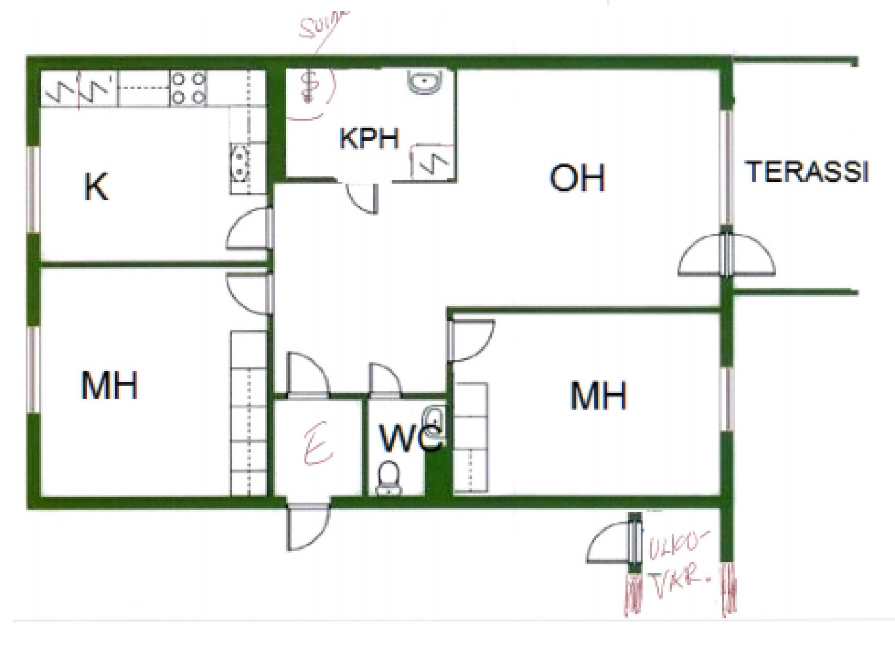
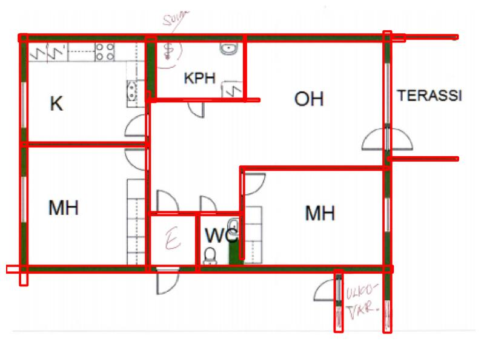
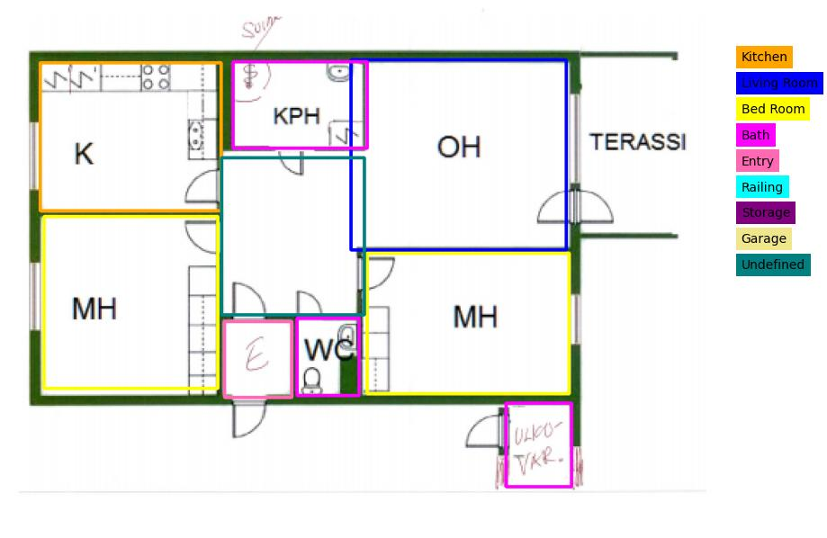

# Machine Learning Engineer Test: Computer Vision and Object Detection

## Updates

- **Date: 04-10-2024**  
  Made the required changes previously. Improved the indexing of the DataLoader. Focused on only using the "high_quality" folder from the CubiCasa5k dataset. Increased the amount of data for training for better results.

## Objective
This test aims to assess your skills in computer vision and object detection, with a specific focus on detecting room walls and identifying rooms in architectural blueprints or pre-construction plans.

This test evaluates your practical skills in applying advanced computer vision techniques to a specialized domain and your ability to integrate machine learning models into a simple API server for real-world applications.

Good luck!

## Approach
A Mask R-CNN model was trained on a partial CubiCasa5k dataset for 20 epochs. The CubiCasa5k dataset has annotations for 12 classes: "Background", "Outdoor", "Wall", "Kitchen", "Living Room", "Bed Room", "Bath", "Entry", "Railing", "Storage", "Garage", and "Undefined". We have ignored the "Background" class while training.  

For evaluation and visualization, we treat index 2 ("Wall") as the "Wall" class and all other classes (excluding "Background" and "Wall") as the "Room" class.

For more details about the training process and approach, please refer to the [report.pdf](./report.pdf)  file available in this repository.

Scripts utilized for training, evaluating, and visualizing the model are present in the [detector_model_scripts](./detector_model_scripts) directory.

The API has been implemented using FastAPI for seamless inference of room and wall detection.

## Results
| Class      | TP   | FP   | FN   | Precision | Recall  |
|------------|------|------|------|-----------|---------|
| Walls      | 3102 | 968  | 1467 | 0.7622    | 0.6789  |
| Rooms      | 1104 | 694  | 817  | 0.6140    | 0.5747  |

## Visualization

Here are sample images from the results:

- **Input Image**:
  

- **Input Image Annotated with Predicted Walls**:
  

- **Input Image Annotated with Predicted Rooms**:
  

## Installation

1. Clone the repository:
```
git clone https://github.com/VinatG/ml-eng-test.git
```
2. Change the directory
```
cd ml-eng-test
```
3. Download the trained model:  
Due to size constraints, the trained model file is not included in this repository. Since this repository has been forked from another repository, Git LFS (Large File Storage) cannot be used to add larger files. You need to manually download the model using the following link:
    - [Download the trained Mask R-CNN model](https://drive.google.com/file/d/1--NV98C78jFW9xq6i-RKc8VIeh6Sgi1s/view?usp=sharing)

Once downloaded, place the model file in the `detector_model_scripts/checkpoints` directory.

4. Build the Docker container:
```
sudo docker build -t room-wall-detection-app .
```
5. Run the Docker container:
```
sudo docker run -d -p 3000:3000 --network="host" room-wall-detection-app
```
## Usage

### Wall Detection
Run the following curl command to perform wall detection:
```
curl -X POST -F "image=@image.png" "localhost:3000/run-inference?type=wall" --output output.png
```
### Room Detection
Run the following curl command to perform room detection:
```
curl -X POST -F "image=@image.png" "localhost:3000/run-inference?type=room" --output output.png
```


